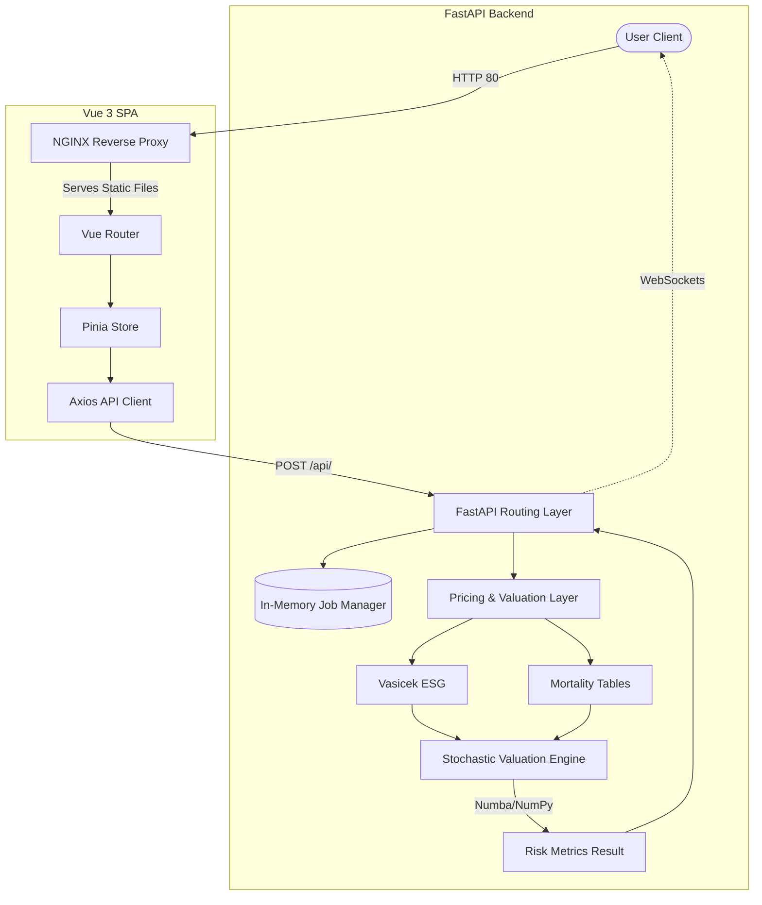

# Technical Audit Report

## 1. Executive Summary
This audit provides a "ground truth" assessment of the Actuarial Valuation & Risk Engine architecture. The system consists of a highly sophisticated, vectorized Python backend (FastAPI, Numba, NumPy) and a modern frontend (Vue 3, Vite, Tailwind CSS). Overall, the computational core is mature and heavily optimized. However, there are significant infrastructure and architectural risks related to event loop blocking, dependency pinning, and Docker image optimization that should be addressed before scaling.

## 2. Backend Deep-Dive
- **Subdirectories:** `api/`, `curves/`, `data/`, `models/`, `pricing/`, `projections/`, `stochastic/`, `tables/`, `valuation/`
- **Entry Point & Server:** The main entry point is `actuary_engine/api/main.py`. The server is launched via Uvicorn (`uvicorn actuary_engine.api.main:app`).
- **Stochastic Modules Check:** 
  - `stochastic/monte_carlo.py` exists and contains the highly sophisticated `StochasticValuationEngine`.
  - **Critical Gap:** `pricing/stochastic_insurance.py` does **not** exist. Instead, the API layer (`api/main.py`) directly instantiates `StochasticValuationEngine` rather than delegating to a separate product wrapper.
- **Codebase Size:** Estimated at ~15,000+ lines of Python code based on the density of the core engine and API (e.g., `api/main.py` alone is >1,100 lines).

## 3. Frontend Deep-Dive
- **Framework:** Vue 3 (Composition API) built with Vite.
- **State Management:** Pinia.
- **UI Libraries:** Tailwind CSS for styling, `echarts` for charting, `@vue-flow/core` for node-based graphs, and `lucide-vue-next` for icons.
- **API Client & Routing:** `axios` is used for HTTP requests (configured in the `services/` directory). The application uses `vue-router` for SPA navigation. The base URL is injected via `VITE_API_URL` during the Docker build.

## 4. Backend Flow Mapping (API → Calculation → Result)
*Example: Asynchronous Stochastic Monte Carlo*
- **API Layer:** `actuary_engine/api/main.py` defines `POST /api/v1/valuation/stochastic/async`. It accepts a Pydantic `StochasticValuationRequest` schema and returns an `AsyncJobCreateResponse`. Authentication is open (no JWT/auth middleware observed).
- **Service/Calculation Layer:** The route delegates to `_run_async_simulation_task` which uses FastAPI's `BackgroundTasks`. Inside, it invokes `_compute_stochastic_valuation_core` which sets up the `VasicekESG` and `StochasticValuationEngine`.
- **Execution:** The simulation is asynchronous, chunking batches of paths. However, heavy CPU-bound numpy computations (`_simulate_batch`) run within the `async` function. 
- **Result Layer:** Real-time progress is streamed via WebSockets (`/ws/simulations/{job_id}`). Results are wrapped in a `StochasticValuationResponse` and stored in an in-memory `job_manager` (no Redis/Celery).

> *The backend flow is: `main.py` route (`start_async_simulation`) → `_run_async_simulation_task` service → `StochasticValuationEngine` calculation → `StochasticValuationResponse` response via in-memory job manager & WebSockets.*

## 5. Frontend Flow Mapping (Page → Component → API → Display)
*Example: Dashboard Interaction*
- **Page/Route:** The Vue Router points to main views. A primary component like `PortfolioDashboard.vue` serves as the UI anchor.
- **Component Hierarchy:** The dashboard component acts as the parent, housing input forms and injecting state from Pinia stores.
- **API Request:** User triggers an action which calls an Axios service method. The service posts a JSON payload to `/api/v1/valuation/stochastic` or `/api/v1/valuation/portfolio`.
- **Display Result:** Loading states are managed reactively. Upon success, complex statistical metrics (VaR, CTE, percentiles) are piped into `echarts` components to render fan charts and histograms.

> *The frontend flow is: `Dashboard View` renders `Form Component` which triggers `Axios Service` → request sent to `/api/v1/valuation/stochastic` → response populates `Pinia Store` → displayed in `ECharts Component`.*

## 6. Infrastructure & Deployment
- **Dockerfile:** Uses `python:3.10-slim`. It uses the `COPY . .` pattern which is an anti-pattern if a rigorous `.dockerignore` isn't maintained (can bloat the image with `__pycache__` and tests). It runs a production-ready `uvicorn` server. It is a single-stage build.
- **docker-compose.yml:** Defines `backend` (port 8000) and `frontend` (port 3000). Passes `VITE_API_URL` dynamically. Services are isolated on the default docker network.
- **nginx.conf:** Acts as a reverse proxy for the FastAPI backend (`/api/`) and serves the static Vue SPA on port 80. It passes standard `X-Forwarded` headers. Traffic is plain HTTP (no SSL configuration). No rate-limiting is configured.

## 7. Dependency Analysis
- **Backend (`requirements.txt`):** Includes robust math libraries (`numpy`, `scipy`, `pandas`, `numba`) and async tools (`fastapi`, `websockets`, `uvicorn`). 
  - *Risk:* Versions are loosely pinned (e.g., `>=1.26.0`). This introduces severe reproducibility risks if a downstream library releases a breaking change.
- **Frontend (`package.json`):** Uses modern libraries (`vue`, `pinia`, `echarts`, `axios`). Dependencies are generally up-to-date and using caret `^` versioning.

## 8. Critical Gaps & Blockers (Priority List)

1. **Synchronous Blocking of Async Event Loop (Critical Performance Risk):** 
   Heavy CPU-bound Monte Carlo array calculations (e.g., `_simulate_batch`) are called inside an `async def` task without utilizing `asyncio.to_thread` or a `ProcessPoolExecutor`. While `BackgroundTasks` executes in a thread pool for *sync* functions, because the target is *async*, it will lock the main ASGI event loop during matrix operations, crashing concurrent HTTP requests.
2. **Missing Architectural Abstraction:**
   The `pricing/stochastic_insurance.py` wrapper you requested is absent. The API tightly couples the HTTP schemas directly to the raw `StochasticValuationEngine`.
3. **Loose Dependency Pinning:**
   `requirements.txt` uses `>=` instead of `==`. A minor release in `numpy` or `pandas` could silently break the production image build.
4. **Docker Image Bloat:**
   The `Dockerfile` lacks a multi-stage build, meaning compilers needed for `numba` and `scipy` (if compiling from source) or leftover caches will inflate the production image size. `COPY . .` should be audited alongside `.dockerignore`.

## 9. Visual Architecture Diagram

