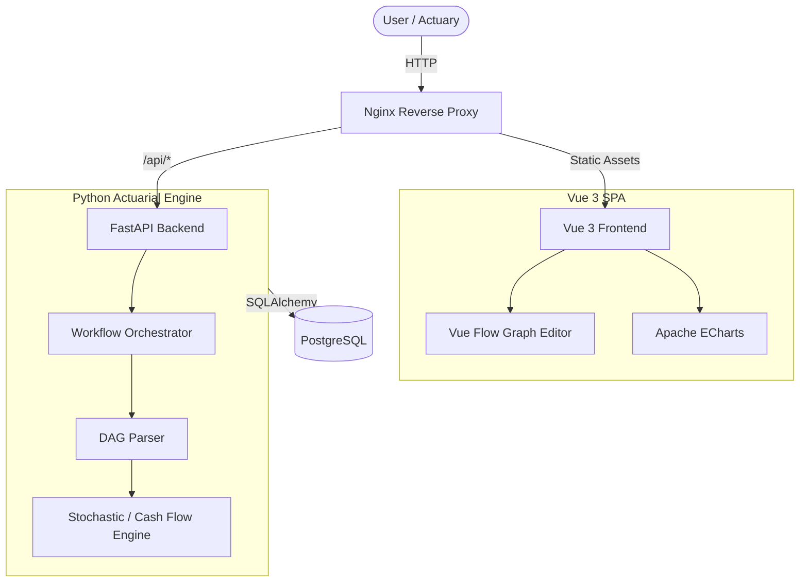

# System Architecture

Actura is built with a modern decoupled architecture that separates complex actuarial computations from the user interface. It utilizes a containerized microservices approach for easy deployment and scaling.

## 🏗️ High-Level Diagram

## 🧩 Components

### 1. Frontend (Vue 3 + Vite)
- **State Management:** Uses Vue's Composition API and generic stores to manage workflow state.
- **Visual Logic Editor:** Built on top of **Vue Flow**, providing an interactive canvas for actuaries to build cash flow graphs (Blueprints).
- **Data Visualization:** **Apache ECharts** provides highly performant canvas-based rendering for large arrays of stochastic results, ensuring smooth 60fps charting.

### 2. Backend (FastAPI + Python)
- **API Layer:** Exposes RESTful endpoints for projects, contracts, and runs.
- **Engine Core:** Uses `numpy`, `pandas`, and `scipy` for vectorized actuarial mathematics, easily handling thousands of Monte Carlo scenarios in sub-second times.
- **Orchestration:** Manages state transitions (Project -> Product -> Blueprint -> Results).

### 3. Database (PostgreSQL)
- Relational schema managed via **SQLAlchemy**.
- Stores Projects, Blueprints (as JSON blobs), and Run Histories.

### 4. Reverse Proxy (Nginx)
- Routes traffic on port 3000 to the static frontend and port 8000 to the backend API (`/api/`).
- Resolves CORS complexities and acts as a unified entrypoint.
