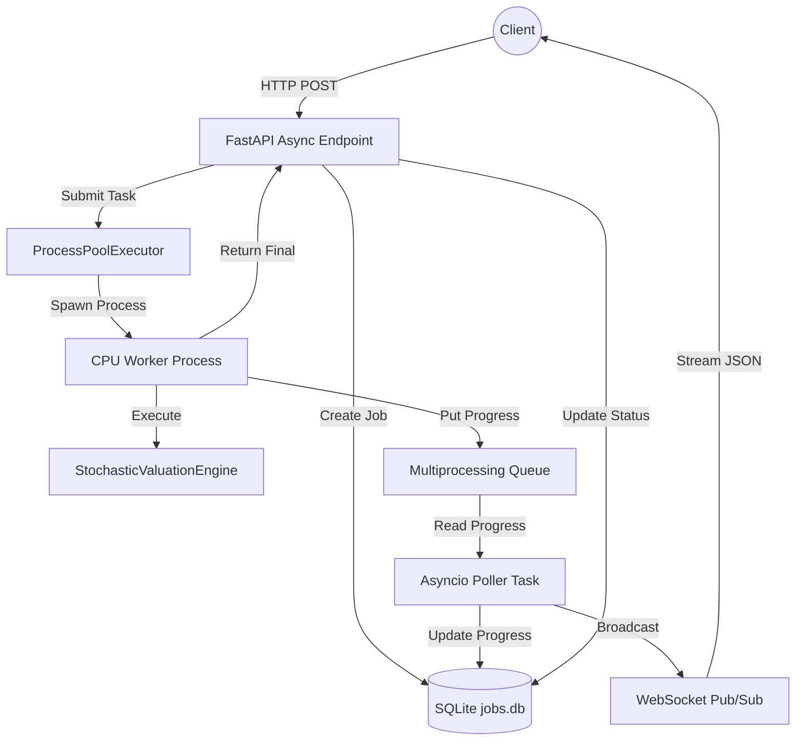

# Asynchronous Job Execution Architecture

Actura performs computationally heavy tasks, specifically large-scale stochastic Monte Carlo valuation. Running these CPU-bound tasks in the main FastAPI (ASGI) event loop blocks other concurrent requests.

To solve this, Actura implements a robust background worker abstraction using Python's native concurrency primitives.

## Architecture Diagram

## Core Components

1. **`JobManager` (`actuary_engine/api/job_manager.py`)**: 
   - Manages the lifecycle of jobs.
   - Backed by a local SQLite database (`jobs.db`) to ensure persistent job state across restarts.
   - Manages an in-memory WebSocket subscriber list for active progress streaming.

2. **`ProcessPoolExecutor` (`actuary_engine/api/main.py`)**:
   - A global pool of Python processes initialized on application startup.
   - Decouples heavy NumPy/Numba execution from the main API thread.

3. **CPU Worker (`actuary_engine/api/worker.py`)**:
   - Executes the core simulation synchronously in a separate memory space.
   - Reconstructs unpicklable objects (like Pydantic models and complex dataclasses) from simple dictionary payloads.

4. **Progress Queue**:
   - The worker periodically pushes progress payloads to a `multiprocessing.Queue`.
   - An asyncio background task in the main ASGI loop actively polls this queue, updating the SQLite database and broadcasting via WebSockets to the frontend without holding the GIL.

## Why ProcessPoolExecutor over Celery?

For the current prototype phase, introducing Redis + Celery adds unnecessary infrastructure overhead (requiring multiple Docker containers and broker orchestration). The `ProcessPoolExecutor` + SQLite combination provides the exact required decoupling natively, is fully portable, and establishes the same architectural boundaries needed for an eventual migration to a distributed task queue as the system scales.
